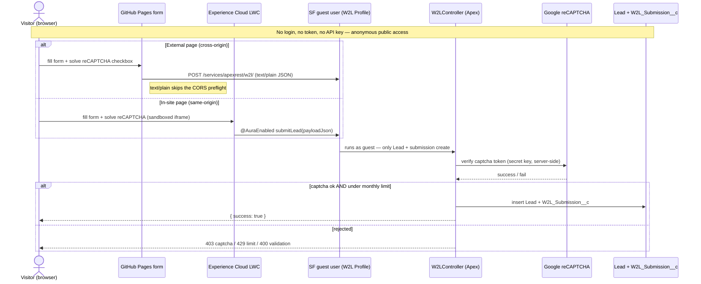

# sf-web-to-lead

A **public, unauthenticated Web-to-Lead** solution for Salesforce with **two entry points**, both
backed by the same Apex controller and the same isolated Experience Cloud guest user.

| Entry point | Where it lives | How it reaches Salesforce |
|-------------|----------------|---------------------------|
| **External form** | `index.html` on **GitHub Pages** (`https://dmvictor83.github.io/sf-web-to-lead/`) | POSTs JSON to a guest **Apex REST** endpoint |
| **In-site form** | `w2lLeadForm` LWC on the **W2L Experience Cloud** site (`.../my.site.com/w2l/`) | Calls Apex directly via **`@AuraEnabled`** (same-origin) |

Both: verify **reCAPTCHA v2** server-side → enforce a **1,000/month** limit → validate + sanitize →
insert a `Lead` (`LeadSource = Web`) + a `W2L_Submission__c` record.

```
External:  GitHub Pages form ──POST text/plain JSON──▶ @HttpPost handlePost ─┐
In-site:   Experience Cloud LWC ──@AuraEnabled────────▶ submitLead ──────────┤
                                                                             ▼
                                                    process() → Lead + W2L_Submission__c
```

---

## Security model

**There is no authentication.** A public web page cannot hold a secret — anything in client-side
HTML/JS (API keys, tokens) is visible via *View Source*. So both endpoints are **anonymous and
open**: anyone on the internet can POST to them (with `curl`, Postman, a script — not just the form).
Salesforce runs each request as a locked-down **guest user** (`W2L Profile`).

Because there's no auth, security comes from **constraining what the endpoint can do and who can
usefully call it** — defense in depth:

| Layer | What it protects against | Where it lives |
|-------|--------------------------|----------------|
| **Least-privilege guest** | The guest can *only* create `Lead` + `W2L_Submission__c`. It can't read your data, delete, or touch any other object. | `W2L Profile` |
| **reCAPTCHA v2 (server-verified)** | Bots. The token is verified server-side against Google; the secret key never reaches the browser. | `W2LController.verifyCaptcha` |
| **Rate limit (1,000/month)** | Runaway abuse volume. Counts `W2L_Submission__c` records for the month. | `W2LController.currentMonthCount` |
| **Validation + sanitization** | Bad data / stored XSS. Requires last name, company, valid email; `stripHtmlTags()` on every field. | `W2LController.process` |
| **CORS allowlist** | *Other* websites reading the response in a victim's browser. | `GitHubPages` + Apex headers |

### Request flow (both entry points)



**How "authentication" works here:** it doesn't — and that's by design. Neither page sends
credentials. Salesforce assigns every anonymous request the **guest user** identity tied to the
site, and that guest's profile (`W2L Profile`) is scoped to *only* create a `Lead` and a
`W2L_Submission__c`. The external and in-site pages differ only in **transport** (REST vs.
`@AuraEnabled`); both converge on the same guest identity and the same `process()` logic, where the
real controls — reCAPTCHA, rate limit, validation — are enforced server-side.

### What CORS is (and isn't)

CORS is a **browser** rule: it decides whether JavaScript on origin A may *read* a response from
server B. Server B grants it with the `Access-Control-Allow-Origin` header. It is **not** an
access-control or anti-abuse mechanism — `curl`/Postman/servers ignore CORS entirely. So CORS here
is a browser-trust signal, **not** a security boundary.

> The external form sends `Content-Type: text/plain` specifically to stay a CORS "simple request"
> and skip the preflight `OPTIONS` call, which Salesforce guest sites don't answer.

### Real, honest risks

- **Direct calls bypass the form.** reCAPTCHA and CORS are browser-enforced; a script can hit the
  endpoint directly. reCAPTCHA (which requires solving a challenge) is the meaningful bot deterrent —
  **not** CORS.
- **Spam leads.** Captcha-solving services exist; some junk will get through. The rate limit caps
  the blast radius at 1,000/month, but those could be 1,000 junk leads.
- **Global rate limit = possible DoS of lead capture.** The 1,000/month counter is org-wide, so one
  abuser could exhaust the quota and block legitimate submissions. (Per-IP limiting isn't practical
  on a guest site — Apex can't reliably see the client IP.)
- **Secret key stored as plain text.** `W2L_Settings__c.ReCaptcha_Secret_Key__c` is a Text field
  (EncryptedText wasn't available at this API version). It's server-side only (never shipped to the
  browser), but it isn't encrypted at rest — anyone with access to that setting can read it.
- **Guest user is a known Salesforce attack surface.** Safety depends on the guest profile staying
  minimal. If someone later widens its object/field access, or a sharing rule leaks records to it,
  the anonymous endpoint inherits that. This is exactly why W2L uses its **own** minimal guest
  profile, isolated from any other site's guest.

### Golden rules

- Never expose anything the guest can *read* — it should only *create* Leads.
- Keep **reCAPTCHA** as the primary bot defense; treat CORS as convenience, not security.
- Keep the guest profile minimal and **audit it periodically**.
- Rotate the reCAPTCHA keys if they're ever shared in plain text.

> **Want a stronger boundary?** Put a small server-side proxy (e.g. a Cloudflare Worker or Netlify
> function) in front. It can hold a real OAuth secret, do proper per-IP or per-country throttling,
> and hide the Salesforce endpoint — the browser talks to the proxy, the proxy talks to Salesforce
> with real credentials. That trades a maintained server for tighter control. Country-level geo
> restriction (e.g. US/CA/IL only) is only possible via such a proxy — Salesforce has no native
> geo-blocking for guest endpoints, and geo-IP is easily bypassed by VPNs anyway.

---

## What gets saved (Apex field mapping)

On a successful submission, `W2LController.process()` creates **two records**:

### 1. A `Lead` (standard object)

Each JSON payload field maps to a standard `Lead` field. Every text value is trimmed and passed
through `stripHtmlTags()` first (`sanitize()`).

| Payload field (from form) | → | `Lead` field | Notes |
|---------------------------|---|--------------|-------|
| `firstName` | → | `FirstName` | optional |
| `lastName` | → | `LastName` | **required** |
| `company` | → | `Company` | **required** |
| `email` | → | `Email` | **required**, format-validated |
| `phone` | → | `Phone` | optional |
| `website` | → | `Website` | optional |
| `street` | → | `Street` | optional |
| `city` | → | `City` | optional |
| `state` | → | `State` | optional — **full name** ("Texas"), State picklist |
| `postalCode` | → | `PostalCode` | optional |
| `country` | → | `Country` | **full name** ("United States"), Country picklist |
| *(constant)* | → | `LeadSource` | always set to `'Web'` |

> `captchaToken` is **not** stored — it's consumed by server-side reCAPTCHA verification and discarded.

The Lead lands in **Setup → Object Manager → Lead → Leads tab** (standard Lead list views /
reports). It has no owner assignment logic here, so it follows your org's default guest-created-record
ownership. Add assignment rules / a default lead owner if you need routing.

### 2. A `W2L_Submission__c` (custom tracking object)

One record per submission, linked to the Lead via the `Lead__c` lookup:

| `W2L_Submission__c` field | Value |
|---------------------------|-------|
| `Name` | Auto-number |
| `Lead__c` | Id of the Lead just inserted |
| `CreatedDate` | (system) — the monthly rate limit counts these for the current month |

This object exists so the **1,000/month rate limit** can be counted reliably (one row per accepted
submission) without a race-prone counter field.

```apex
Lead lead = new Lead(
    FirstName  = sanitize(body.get('firstName')),
    LastName   = lastName,          // required
    Company    = company,           // required
    Email      = email,             // required + validated
    Phone      = sanitize(body.get('phone')),
    Website    = sanitize(body.get('website')),
    Street     = sanitize(body.get('street')),
    City       = sanitize(body.get('city')),
    State      = sanitize(body.get('state')),
    PostalCode = sanitize(body.get('postalCode')),
    Country    = sanitize(body.get('country')),
    LeadSource = 'Web'
);
insert lead;
insert new W2L_Submission__c(Lead__c = lead.Id);
```

---

## Repo layout

Each row is one component and what it does. "Used by" shows which entry point relies on it —
**External** (GitHub Pages form), **In-site** (Experience Cloud LWC), or **Both**.

### Root

| File | What it is |
|------|------------|
| `index.html` | The external static form. Deploy this to GitHub Pages. |
| `sfdx-project.json` | SFDX project config so `sf project deploy start` works. |
| `CLAUDE.md` | Architecture notes + gotchas for anyone (or Claude) editing the repo. |
| `README.md` | This file — deploy guide. |

### Salesforce metadata (`force-app/main/default/`)

| Component | Type | Used by | What it does |
|-----------|------|:-------:|--------------|
| `W2LController` | Apex class | Both | The brain. Verifies reCAPTCHA, enforces the monthly limit, validates, inserts the Lead. Exposes a REST method (`@HttpPost`, for the external form) and an Aura method (`@AuraEnabled submitLead`, for the LWC) that share one `process()` method. |
| `W2LControllerTest` | Apex class | — | 11 unit tests covering captcha, rate limit, validation, and both entry points. |
| `w2lLeadForm` | LWC | In-site | The form component you drag onto the Experience Cloud page. |
| `w2lCaptcha` | Static resource | In-site | A tiny HTML page that hosts the reCAPTCHA widget in an `<iframe>`. Needed because Lightning Web Security won't let reCAPTCHA run directly inside an LWC. |
| `W2L_Submission__c` | Custom object | Both | One record is created per submission. The monthly rate limit counts these. |
| `W2L_Settings__c` | Custom setting | Both | Stores the reCAPTCHA **site key**, **secret key**, and **monthly limit**. Read by the Apex at runtime. |
| `W2L Profile` | Profile | In-site | The Experience Cloud site's **guest user** profile, scoped to *only* create `Lead` + `W2L_Submission__c`. This is the isolated identity the public uses. |
| `GitHubPages` | CORS whitelist | External | Allows the browser on `dmvictor83.github.io` to read the endpoint's response. |
| `GoogleRecaptcha` | Remote site setting | Both | Lets the Apex make its server-side callout to Google to verify the token. |
| `GoogleRecaptcha`, `GoogleRecaptchaStatic` | CSP trusted sites | Both | Allow the reCAPTCHA scripts/assets to load in the browser. |

> Every metadata component is actually two files — the component plus a `*-meta.xml` descriptor.
> They're listed here once for clarity.

---

## Deploy to a new org

Steps marked **🖐 MANUAL** cannot be done via CLI/metadata — they are Setup UI actions.

### 1. 🖐 MANUAL — Create Google reCAPTCHA keys (one-time)

You need a Google account. reCAPTCHA v2 is free (up to ~1M assessments/month).

1. Go to the **reCAPTCHA admin console**: <https://www.google.com/recaptcha/admin/create>
   (if you've used reCAPTCHA before, open <https://www.google.com/recaptcha/admin> and click the **＋** to register a new site).
2. Fill in the registration form:
   - **Label** — any name to recognize it later, e.g. `W2L Form`.
   - **reCAPTCHA type** — choose **Challenge (v2)**, then the sub-option **"I'm not a robot" Checkbox**.
     *(Do not pick v3 or the invisible variant — this solution uses the v2 checkbox.)*
   - **Domains** — add every hostname that will display the form, one per line,
     **hostname only** (no `https://`, no path, no port):
     - `dmvictor83.github.io` — your GitHub Pages host (the external form)
     - `<your-domain>.my.site.com` — your Experience Cloud host (the in-site form)
     - `localhost` — optional, only if you want to test locally
   - **Owners** — your Google email is added automatically.
   - Accept the **Terms of Service** and click **Submit**.
3. Google shows two keys — copy both:
   - **Site key** (public) — goes in the client (HTML / static resource). Safe to expose.
   - **Secret key** (private) — used only in server-side Apex. **Never** put it in HTML.
4. You'll store these in Salesforce in **step 6** (`W2L_Settings__c`).

> **Adding a domain later:** open the site in the admin console → the **⚙ Settings** (gear) →
> **Domains** → add the hostname → **Save**. Changes take ~30–60 seconds to propagate. The classic
> symptom of a missing domain is the widget showing **"ERROR for site owner: Invalid domain for site key."**

> **Where each key ends up:**
> - Site key → `W2L_Settings__c.ReCaptcha_Site_Key__c` **and** it appears in `index.html` /
>   the `w2lCaptcha` static resource (this is expected — the site key is public).
> - Secret key → `W2L_Settings__c.ReCaptcha_Secret_Key__c` **only** (server-side, never shipped to the browser).

### 2. Authenticate the CLI
```bash
sf org login web --alias devedition
```

### 3. 🖐 MANUAL — Enable Digital Experiences (irreversible)
Required to create the Experience Cloud site that gives W2L its own guest user.
> **Setup → Digital Experiences → Settings → Enable Digital Experiences.**
> Choose your permanent `*.my.site.com` domain and save. **This cannot be undone.**

### 4. Create the W2L Experience Cloud site
```bash
sf community create --name "W2L" \
  --template-name "Build Your Own (LWR)" \
  --url-path-prefix "w2lvforcesite" \
  --target-org devedition
```
> This auto-creates the guest user + **`W2L Profile`** guest profile. The site is served at
> `https://<your-domain>.my.site.com/w2l/`.

### 5. Deploy the metadata
```bash
sf project deploy start --target-org devedition --source-dir force-app
```
> Deploys the Apex, LWC, static resource, objects, profiles, CORS, remote site, and CSP.

### 6. 🖐 MANUAL — Store the reCAPTCHA keys
Create the `W2L_Settings__c` org-default record with your keys and limit:
```bash
sf data create record --target-org devedition --sobject W2L_Settings__c \
  --values "SetupOwnerId=<YourOrgId> ReCaptcha_Site_Key__c=<SITE_KEY> ReCaptcha_Secret_Key__c=<SECRET_KEY> Monthly_Submission_Limit__c=1000"
```
> Or via **Setup → Custom Settings → W2L Settings → Manage → New** (org default).
> The **secret** key stays server-side only — never put it in HTML.

### 7. 🖐 MANUAL — Confirm reCAPTCHA allowed domains
You added these in **step 1**, but confirm the site key's **Domains** list (admin console → site →
**⚙ Settings → Domains**) includes both hosts — you may not have known your `my.site.com` domain until
you enabled Digital Experiences in step 3:
- `dmvictor83.github.io` (or your GitHub Pages host) — for the external form
- `<your-domain>.my.site.com` — for the in-site form

Add any that are missing (hostname only), then wait ~30–60 seconds.

### 8. 🖐 MANUAL — Configure the Experience site (Experience Builder)
Open **Setup → Digital Experiences → All Sites → W2L → Builder**, then:
1. Drag the **W2L Lead Form** component onto the **Home** page.
2. **Settings ⚙ → Security & Privacy** → set **Relaxed CSP** (or add `https://www.google.com` and
   `https://www.gstatic.com` as trusted script sources) so the reCAPTCHA iframe loads.
3. **Settings → General** → confirm **Public access** (guest) is enabled.
4. Click **Publish**.
> **Re-publish whenever you change the LWC.** Apex-only changes don't need a republish.

### 9. Update the external form's endpoint
Edit `index.html` → `SF_ENDPOINT` to your org's site host, then push to GitHub Pages:
```js
var SF_ENDPOINT = 'https://<your-domain>.my.site.com/w2l/services/apexrest/w2l/';
```
> Enable GitHub Pages: repo **Settings → Pages → Deploy from branch → main**.

### 10. Verify
```bash
# Should return HTTP 403 (reCAPTCHA rejects the fake token) — proves the endpoint + guest work
curl -s -o /dev/null -w "%{http_code}\n" -X POST \
  "https://<your-domain>.my.site.com/w2l/services/apexrest/w2l/" \
  -H "Content-Type: text/plain" \
  --data '{"lastName":"T","company":"C","email":"c@e.com","captchaToken":"x"}'
```
Then open each form, complete the reCAPTCHA, and submit → a `Lead` appears in Salesforce.

---

## Gotchas (why the code is the way it is)

- **`text/plain` POST** on the external form avoids the CORS preflight that guest sites don't answer.
- **State & Country picklists** are enabled → the forms submit **full names** ("Texas"), not codes.
- **Lightning Web Security** blocks reCAPTCHA in an LWC → it's sandboxed in an **iframe** static
  resource, with the token returned via `postMessage`.
- LWS also blocks the iframe resize handshake → the reCAPTCHA iframe uses a **fixed height** (610px).
- **`@AuraEnabled` result fields** must each be annotated, or the LWC receives `undefined`.
- reCAPTCHA is **domain-locked** — add every host in the admin console.

See `CLAUDE.md` for the working-in-this-repo notes.
